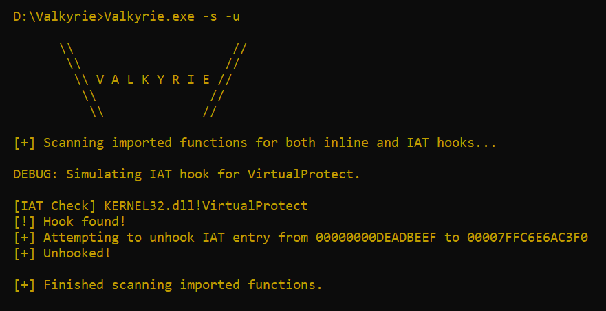

# Valkyrie


A Windows function hook detection / unhooking tool written in C.

# IAT Hook Detection & Unhooking


# Inline Hook Detection & Unhooking


# Compilation as a DLL
Valkyrie's EXE is useful for recon. It will discover and report blatant hooks, but hooks are implemented on a process level.

Unhooking hooked functions using Valkyrie.exe will likely unhook them, but it will only unhook them in Valkyrie.exe's memory space.

As a DLL, Valkyrie can be deployed to unhook functions for other executables Valkyrie.dll is loaded into.

Turning Valkyrie.dll into a reflective DLL for easy, clean execution is ideal, traditional DLL injection would also work.

Tested using the [sRDI](https://github.com/monoxgas/sRDI) project to simplify the conversion into reflective shellcode.

Using sRDI, simply add Valkyrie's reflective shellcode to another tool's source, upon execution, Valkyrie will begin the hunt.

# Building
Using the x64 Native Tools Command Prompt from Visual Studio:

### EXE
```
buildEXE.bat
```
### DLL
DLL is a bit different because arguments Valkyrie relies on must be passed in during compilation.

To make this less of a pain, **buildDLL.bat** accepts arguments which change how the compiled DLL behaves, valid arguments being:
* scan
* unhook
* aggressive
* verbose
```
buildDLL.bat scan
buildDLL.bat scan verbose
buildDLL.bat scan unhook aggressive
```


# EXE Usage
```
-h   Display help banner.
-a   Parse every loaded module's functions for inline hooks.
-s   Scan for both IAT hooks and inline hooks.
-u   Unhook detected hooks.
-v   Verbose output.
```

# Current Shortcomings
Valkyrie relies on VirtualProtect to perform inline unhooking by temporarily modifying module memory page permissions.

If VirtualProtect is hooked, well, you see the problem.

***Note: Valkyrie is a hobby project, it has been exclusively tested against simple MS-Detours hooks in benign binaries.
I would like to imagine security products wouldn't be interfered with as easily, test it out with that in mind.***

# References
* [Sektor7](https://institute.sektor7.net/)
* [AMD64 Architecture Programmer’s Manual](https://www.amd.com/system/files/TechDocs/40332.pdf)
* [Vergilius Project](https://www.vergiliusproject.com/kernels/x64/Windows%2011/22H2%20(2022%20Update))
* [ChatGPT](https://openai.com/blog/chatgpt)
