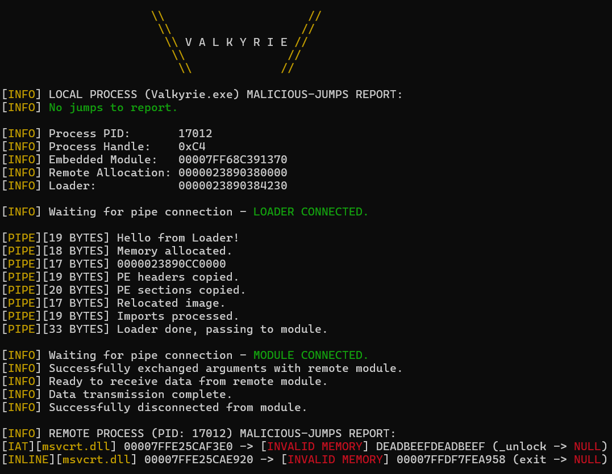

# Valkyrie

A Windows function hook detection / unhooking tool written in C.

# Features

* Embedded Module     - LdrValkyrie.dll gets embedded into Valkyrie.exe's .rdata section during build.
* Reflective Loader   - Buries embedded module into remote processes.
* IPC                 - Command and control the reflective module buried in remote processes.
* API Hashing         - Dynamically resolves required hashed APIs.
* Indirect Syscalls   - Dodge potential function hooks on high value APIs.
* IAT Hook Removal    - Detects and removes hooks on the Import Address Table.
* Inline Hook Removal - Detects and removes hooks at the base of imported functions.

# Program Flow

# Building

Valkyrie's Indirect Syscall implementation requires [NASM](https://www.nasm.us/) to be installed and `nasm.exe` to be available in %PATH%.

Valkryie also requires Python to be installed and available in order to embed the compiled module into Valkyrie.exe

Run `build.bat` from Visual Studio's x64 Native Tools Command Prompt to build `bin/Valkyrie.exe`

# Important Note

Valkyrie is a hobby project and a means to test and strengthen my Windows tool / C development abilities.

It exists solely for demonstration, not as a serious reliable tool, it has only been tested injecting into `Powershell.exe`, nothing else.